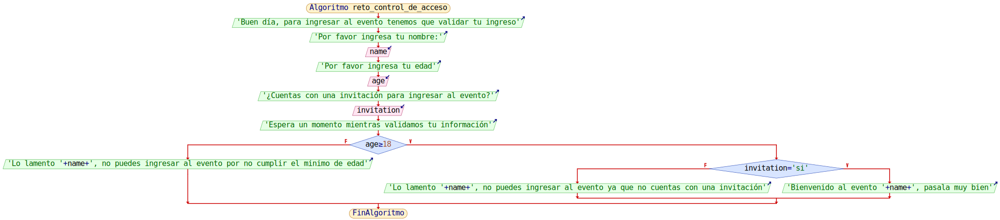

<h1>Control de acceso</h1>

Este primer reto de la semana 3, tiene como objetivo el imitar un sistema de validación de entrada de invitados a un evento, manteniendo dos requisitos principales del exclusión que son, su edad y si cuenta con una invitación, donde a cada usuario que no sea mayor de edad y no cuente con una invitació no podra acceder al evento

