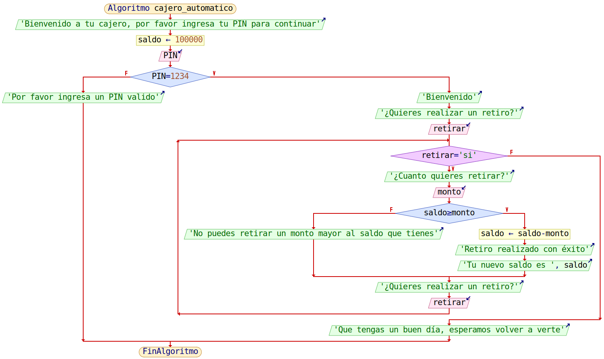

<h1>Cajero automático</h1>

Este segundo reto de la semana 3, tiene como objetivo el imitar un sistema de cajero automático, donde al cliente se le solicita su PIN y con base en el se verifica su identidad y lew permtie al usuario realizar multiples retiros del valor disponible de su cuenta, cada persona cuenta con un valor de 100000, los cuales pueden retirar en multiples transacciones durante la ejecución del proceso, si llegan a un monto de 0 o quieren retirar un monto mayor del que tienen disponible, el sistema no permitira realziar la transacción

