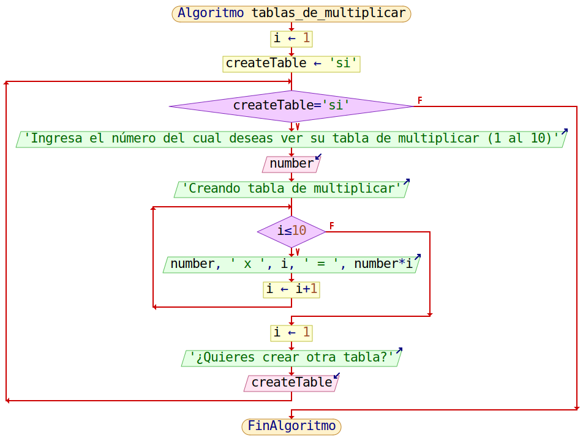

<h1>Tablas de multiplicar</h1>

Este tercer reto de la semana 3, tiene como objetivo mostrar una lista de las tablas de multiplicar del 1 al 10 dependiendo del número dado por el usuario, este numero debe ser mayor a 0 y si este desea, podra repetir el proceso para revisar la tabla de otros números las veces que sea necesario.

